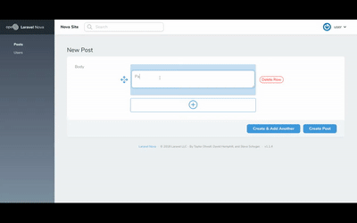

# Laravel Nova / Post Content

This package adds a custom field to nova resources. 

The field is a post content writer and supports images, videos, paragraphs and carousels.



[Demo Video](https://www.useloom.com/share/f06ba29ccf914e17821c98710cf68114)

## How it works

This package adds orderable rows:

Currently this package works only supports :
- Plain text paragraphs.
- Url-provided images.
- Url-provided videos (Youtube | Vimeo | Server Storage).
- Images / Videos carousels.

## Installation and usage

You may require this package using composer:

```
composer require guillaumeferron/PostContent
```

You can directly use the PostContent in the ```fields()``` methods by relating it to a **longText** SQL attribute:

```
PostContent::make('attribute_name')
```

### Customization
You can customize the field behavior :


##### withFields
```
PostContent::make('attribute_name')->withFields([options])
```
*Choose the fields to be added as new rows*

| Function              | Type   | Default                                | Values                                 |
|-----------------------|--------|----------------------------------------|----------------------------------------|
| ->withFields(options) | Array  | ['text', 'image', 'video', 'carousel'] | {'text', 'image', 'video', 'carousel'} |


##### withCarouselFields
```
PostContent::make('attribute_name')->withCarouselFields([options])
```
*Choose the fields to be added as new carousel's slides*

| Function              | Type   | Default                                | Values                                 |
|-----------------------|--------|----------------------------------------|----------------------------------------|
| ->withCarouselFields([options]) | Array  | ['image', 'video'] | {'image', 'video'} |


##### withFileManager
```
PostContent::make('attribute_name')->withFileManager('url')
```
*Specify the file manager url if it exists. Recommendation: [Nova FileManager](https://packagist.org/packages/infinety-es/nova-filemanager)*

| Function              | Type   | Default                                |
|-----------------------|--------|----------------------------------------|
| ->withFileManager('url') | String  | '' |


##### hideHelpers
```
PostContent::make('attribute_name')->hideHelpers()
```
*Hide the blue background helpers displayed when a row needs to be filled*

## Roadmap
- [] Make the initial row dynamic depending on what fields are specified or not.
- [] Make the paragraphs' text editor WYSIWYG.
- [] Add the two columns options to the paragraphs.


## License

The MIT License (MIT). Please see [License File](LICENSE.md) for more information.
